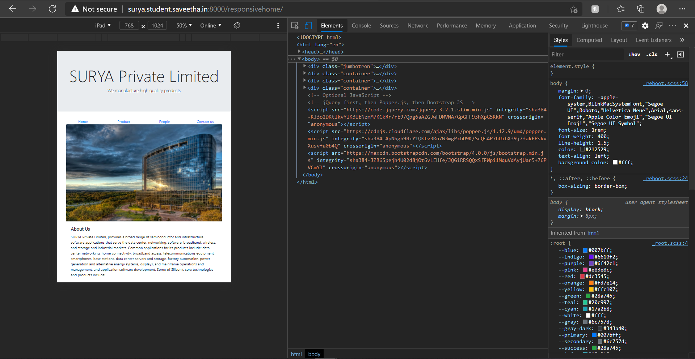

# Design of Responsive Website
## AIM:
To design a responsive website with two break points.

## DESIGN STEPS:
### Step 1: 
Requirement collection.
### Step 2:
Creating the layout using HTML and CSS.
### Step 3:
Updating the sample content.
### Step 4:
Choose the appropriate style and color scheme.
### Step 5:
Validate the layout in various browsers.
### Step 6:
Validate the HTML code.
### Step 7:
Create a database model and migrate the database.
### Step 8:
Retrieve data from database and display it in a dynamic webpage.
### Step 9:
Publish the website in the given URL.

## PROGRAM:

### responsivebase.html
```

<!doctype html>
<html lang="en">
  <head>
    <!-- Required meta tags -->
    <meta charset="utf-8">
    <meta name="viewport" content="width=device-width, initial-scale=1, shrink-to-fit=no">

    <!-- Bootstrap CSS -->
    <link rel="stylesheet" href="https://maxcdn.bootstrapcdn.com/bootstrap/4.0.0/css/bootstrap.min.css" integrity="sha384-Gn5384xqQ1aoWXA+058RXPxPg6fy4IWvTNh0E263XmFcJlSAwiGgFAW/dAiS6JXm" crossorigin="anonymous">

    <title>SURYA Limited</title>
  </head>
  <body>
    <div class="jumbotron">
        <div class="container text-center">
            <h1 class="display-3">SURYA Private Limited</h1>
            <p class="lead">We manufacture high qualilty products</p>
        </div>
    </div>
    <div class="container">
        <div class="row text-center">
            <div class="col-12 col-md-3"><a href="/responsivehome">Home</a></div>
            <div class="col-12 col-md-3"><a href="/responsiveproduct">Product</a></div>
            <div class="col-12 col-md-3"><a href="/responsivepeople">People</a></div>
            <div class="col-12 col-md-3"><a href="/responsivecontact">Contact us</a></div>
        </div>
    </div>
    <div class="container">
        
    
    </div>
    <div class="container">
        <div class="row align-items-end">
            <div class="col text-center">
                Copyright © 2021 SURYA Private Limited, Developed by SURYA R
            </div>
        </div>
    </div>
    <!-- Optional JavaScript -->
    <!-- jQuery first, then Popper.js, then Bootstrap JS -->
    <script src="https://code.jquery.com/jquery-3.2.1.slim.min.js" integrity="sha384-KJ3o2DKtIkvYIK3UENzmM7KCkRr/rE9/Qpg6aAZGJwFDMVNA/GpGFF93hXpG5KkN" crossorigin="anonymous"></script>
    <script src="https://cdnjs.cloudflare.com/ajax/libs/popper.js/1.12.9/umd/popper.min.js" integrity="sha384-ApNbgh9B+Y1QKtv3Rn7W3mgPxhU9K/ScQsAP7hUibX39j7fakFPskvXusvfa0b4Q" crossorigin="anonymous"></script>
    <script src="https://maxcdn.bootstrapcdn.com/bootstrap/4.0.0/js/bootstrap.min.js" integrity="sha384-JZR6Spejh4U02d8jOt6vLEHfe/JQGiRRSQQxSfFWpi1MquVdAyjUar5+76PVCmYl" crossorigin="anonymous"></script>
  </body>
</html>
```

### responsivehome.html
```



<div class="card">
  
  <div class="card-body">
    <h5 class="card-title">About Us</h5>
    <p class="card-text">SURYA Private Limited, provides a broad range of semiconductor and infrastructure software applications that serve the data center, networking, software, broadband, wireless, and storage and industrial markets. Common applications for its products include: data center networking, home connectivity, broadband access, telecommunications equipment, smartphones, base stations, data center servers and storage, factory automation, power generation and alternative energy systems, displays, and mainframe operations and management, and application software development. Some core technologies and products include:
    <ul>
        <li>Graphics card</li>
        <li>SATA HDD</li>
        <li>SATA SSD </li>
        <li>Power unit</li>
        <li>Memory chip</li>
        <li>Processor</li>
    </ul>
  </div>
</div>

```

### responsiveproducts.html
```



<div class="row text-center">
    <div class="col-12">
        <p class="lead">Our Premium Products</p>
    </div>
  
</div>
<div class="row text-center">
    <div class="card col-12 col-md-6 col-lg-3">
    
    <div class="card-body">
        <h5 class="card-title"><b>Samsung 970 EVO Plus 250GB</b></h5>
        <p class="card-text">(PCIe NVMe M.2 (2280) Internal Solid State Drive (SSD) (MZ-V7S250))<br>Price:₹ 4,953.00 </p>
        <a href="https://www.amazon.in/Samsung-Internal-Solid-State-MZ-V7S250BW/dp/B07MHXYL6T/" class="btn btn-primary">Buy now</a>
    </div>
    </div>
    <div class="card col-12 col-md-6 col-lg-3">
    
    <div class="card-body">
        <h5 class="card-title"><b>Seagate Barracuda Q5 500 GB Internal SSD</b></h5>
        <p class="card-text">(M.2 NVMe PCIe Gen3 ×4, 3D QLC for Desktop or Laptop, 1-Year Rescue Services (ZP500CV3A001))<br> Price:₹ 5,099.00</p>
        <a href="https://www.amazon.in/Seagate-Barracuda-500-GB-Internal-SSD/dp/B08LB86XJW/" class="btn btn-primary">Buy now</a>
    </div>
    </div>
    <div class="card col-12 col-md-6 col-lg-3">
    
    <div class="card-body">
        <h5 class="card-title"><b>Gigabyte GeForce RTX 2080 Super Gaming OC</b></h5>
        <p class="card-text">(8G Graphics Card, 3X WINDFORCE Fans, 8GB 256-Bit GDDR6, GV-N208SGAMING OC-8GC Video Card)<br>Price:₹ 79,900.00</p>
        <a href="https://www.amazon.in/Gigabyte-Graphics-WINDFORCE-GV-N208SGAMING-OC-8GC/dp/B07V5HFNFY/" class="btn btn-primary">Buy now</a>
    </div>
    </div>
    <div class="card col-12 col-md-6 col-lg-3">
    
    <div class="card-body">
        <h5 class="card-title"><b>GIGABYTE Nvidia GeForce RTX™ 3060 Ti Gaming OC</b></h5>
        <p class="card-text">(8GB GDDR6 Graphics Card ( GV-N306TGAMING OC-8GD))<br>Price:₹ 49,499.00</p>
        <a href="https://www.amazon.in/GIGABYTE-GeForce-Graphics-GV-N306TGAMING-OC-8GD/dp/B08NW2X37Z/" class="btn btn-primary">Buy now</a>
    </div>
    </div>
    <div class="card col-12 col-md-6 col-lg-3">
    
    <div class="card-body">
        <h5 class="card-title"><b>Intel Core i7-10700K Desktop Processor</b></h5>
        <p class="card-text"> (8 Cores up to 5.1 GHz Unlocked  LGA1200 (Intel 400 Series chipset) 125W)<br>Price:₹ 35,650.00</p>
        <a href="https://www.amazon.in/Intel-i7-10700K-Desktop-Processor-Unlocked/dp/B086ML4XSB/" class="btn btn-primary">Buy now</a>
    </div>
    </div>
    <div class="card col-12 col-md-6 col-lg-3">
    
    <div class="card-body">
        <h5 class="card-title"><b>AMD Ryzen 7 3700X Desktop Processor </b></h5>
        <p class="card-text">(8 Cores up to 4.4GHz 36MB Cache AM4 Socket (100-100000071BOX))<br>Price:	₹ 31,249.00</p>
        <a href="https://www.amazon.in/AMD-Ryzen-3700X-Processor-100000071BOX/dp/B07SXMZLPK/" class="btn btn-primary">Buy now</a>
    </div>
    </div>
    <div class="card col-12 col-md-6 col-lg-3">
    
    <div class="card-body">
        <h5 class="card-title"><b>Ballistix Crucial RGB 3000 MHz DDR4 DRAM Desktop Gaming</b></h5>
        <p class="card-text">(Memory Kit 16GB (8GBx2) CL15 BL2K8G30C15U4BL (Black))<br>Price:₹ 7,245.00 </p>
        <a href="https://www.amazon.in/Ballistix-Crucial-Desktop-Gaming-BL2K8G30C15U4BL/dp/B083VMW862/" class="btn btn-primary">Buy now</a>
    </div>
    </div>
    <div class="card col-12 col-md-6 col-lg-3">
    
    <div class="card-body">
        <h5 class="card-title"><b>G.SKILL Trident Z RGB 16GB (2 * 8GB)</b></h5>
        <p class="card-text"> (DDR4 3200 MHz CL16-18-18-38 1.35V Desktop Memory RAM - F4-3200C16D-16GTZR)<br>Price:₹ 10,500.00</p>
        <a href="https://www.amazon.in/G-SKILL-Trident-Memory-Module-3200Mhz/dp/B01MTDEYHU/" class="btn btn-primary">Buy now</a>
    </div>
    </div>
    <div class="card col-12 col-md-6 col-lg-3">
    
    <div class="card-body">
        <h5 class="card-title"><b>Ant Esports VS500L</b></h5>
        <p class="card-text"> (Power Supply)<br>Price:₹ 1,925.00</p>
        <a href="https://www.amazon.in/Ant-Esports-VS500L-Power-Supply/dp/B08D6HKTH3/" class="btn btn-primary">Buy now</a>
    </div>
    </div>
    <div class="card col-12 col-md-6 col-lg-3">
    
    <div class="card-body">
        <h5 class="card-title"><b>Corsair CV450</b></h5>
        <p class="card-text"> (CV Series, 80 Plus Bronze Certified, 450 Watt Non-Modular Power Supply - Black)<br>Price:₹ 3,341.00</p>
        <a href="https://www.amazon.in/Corsair-Bronze-Certified-Non-Modular-Supply/dp/B07YVVXYFN/" class="btn btn-primary">Buy now</a>
    </div>
    </div>
    <div class="card col-12 col-md-6 col-lg-3">
    
    <div class="card-body">
        <h5 class="card-title"><b>Seagate Barracuda 1 TB Internal Hard Drive HDD </b></h5>
        <p class="card-text"> (2.5 Inch SATA 6 Gb/s 5400 RPM 128 MB Cache for PC Laptop (ST1000LM048))<br>Price:₹ 3,899.00 </p>
        <a href="https://www.amazon.in/Seagate-Laptop-2-5-Inch-Internal-ST1000LM048/dp/B01LY3Q201/" class="btn btn-primary">Buy now</a>
    </div>
    </div>
    <div class="card col-12 col-md-6 col-lg-3">
    
    <div class="card-body">
        <h5 class="card-title"><b>Seagate 2TB Laptop HDD SATA</b></h5>
        <p class="card-text"> (6GB/s 128MB Cache 2.5-Inch 7mm Thinnest Internal Hard Drive ST2000LM015)<br>Price:₹ 7,645.00 </p>
        <a href="https://www.amazon.in/Seagate-2-5-Inch-Thinnest-Internal-ST2000LM015/dp/B01LXRWWB6/" class="btn btn-primary">Buy now</a>
    </div>
    </div>
</div>

```

### responsivepeople.html
```



<div class="row text-center">
    <div class="col-12">
        <p class="lead">Executive Officer's</p>
    </div>
</div>
    <div class='row text-center'>
        <div class="card col-12 col-md-6 col-lg-4">
            <div class="card">
                
            </div>
            <div class="card p-3 text-right">
                <blockquote class="blockquote mb-0">
                    <p>Bill gates</p>
                    <footer class="blockquote-footer">
                        <small class="text-muted">
                            <b>Founder</b> <cite title="Source Title">of the company</cite>
                        </small>
                    </footer>
                </blockquote>
            </div>
        </div>
        <div class="card col-12 col-md-6 col-lg-4">
            <div class="card">
                
            </div>
            <div class="card p-3 text-right">
                <blockquote class="blockquote mb-0">
                    <p>Satya sNadella</p>
                    <footer class="blockquote-footer">
                        <small class="text-muted">
                            <b>Cheif Executive Officer(CEO)</b> <cite title="Source Title">of the company</cite>
                        </small>
                    </footer>
                </blockquote>
            </div>
        </div>
        <div class="card col-12 col-md-6 col-lg-4">
            <div class="card">
                
            </div>
            <div class="card p-3 text-right">
                <blockquote class="blockquote mb-0">
                    <p>Elon Musk</p>
                    <footer class="blockquote-footer">
                        <small class="text-muted">
                            <b>Chief Financial Officer (CFO)</b> <cite title="Source Title">of the company</cite>
                        </small>
                    </footer>
                </blockquote>
            </div>
        </div>
        <div class="card col-12 col-md-6 col-lg-4">
            <div class="card">
                
            </div>
            <div class="card p-3 text-right">
                <blockquote class="blockquote mb-0">
                    <p>Jeff Bezos</p>
                    <footer class="blockquote-footer">
                        <small class="text-muted">
                            <b>Chief Operating Office (COO)</b> <cite title="Source Title">of the company</cite>
                        </small>
                    </footer>
                </blockquote>
            </div>
        </div>
        <div class="card col-12 col-md-6 col-lg-4">
            <div class="card">
                
            </div>
            <div class="card p-3 text-right">
                <blockquote class="blockquote mb-0">
                    <p>Sundar Pichai</p>
                    <footer class="blockquote-footer">
                        <small class="text-muted">
                            <b>Chief Information Officer (CIO)</b> <cite title="Source Title">of the company</cite>
                        </small>
                    </footer>
                </blockquote>
            </div>
        </div>
        <div class="card col-12 col-md-6 col-lg-4">
            <div class="card">
                 
            </div>
            <div class="card p-3 text-right">
                <blockquote class="blockquote mb-0">
                    <p>Mark Zuckerberg</p>
                    <footer class="blockquote-footer">
                        <small class="text-muted">
                           <b>Chief Marketing Officer (CMO)</b><cite title="Source Title">of the company</cite>
                        </small>
                    </footer>
                </blockquote>
            </div>
        </div>
    </div>

 ```

### responsivecontactus.html
```



<div class="card">
  
  <div class="card-body">
    <p class="card-text">
        <hr>
        <div class="col text-center">
        <h4 class="lead">Email: SURYAprivatelimited@gmail.com</h4><br>
        <h4 class="lead">Phone: (760) 858 8185/756 7569</h4><br>
        <h4 class="lead">Address: 20 Cooper Square, New York, NY 10003, USA</h4>
        </div>
        <hr>
    <p>
  </div>
</div>

```


## OUTPUT:

### LAPTOP VIEW:


### MOBILE VIEW:


### IPAD VIEW:




## CODE VALIDATION REPORT:


## RESULT:
Thus a website is designed and is hosted in the URL http://surya.student.saveetha.in:8000/. HTML code is validated.